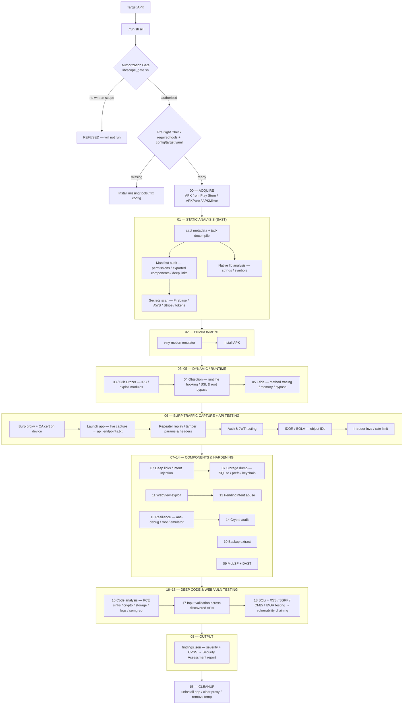

# viny-motion APK Pentesting Pipeline

Automated mobile application security testing pipeline using viny-motion emulator. Covers APK acquisition → static analysis → dynamic instrumentation → traffic capture → findings reporting.

> **Authorized engagements only.** Always obtain written scope before testing any application.

---

## Pipeline Overview



> **What each stage really does** (phase numbers = actual scripts in `phases/`):
> - **00** downloads the APK; **01** runs SAST (aapt/jadx manifest, secrets, native libs);
>   **16** deep code scan (RCE sinks, crypto, storage, logs) + Semgrep MASTG rules.
> - **02** boots viny-motion and installs the APK; **03/03b/04/05** drive it dynamically with
>   drozer, objection and Frida.
> - **06** sets the Burp proxy + CA cert, runs the app on screen and captures traffic into
>   `api_endpoints.txt`, then those endpoints are attacked in Burp (Repeater, auth/JWT,
>   IDOR/BOLA, Intruder).
> - **07–14** cover deep links, storage dump, backup, WebView, PendingIntent, resilience
>   (anti-debug/root/emulator), crypto audit, and MobSF+DAST.
> - **17** runs input-validation probes across the discovered APIs; **18** tests them for
>   SQLi, XSS, SSRF, command injection and IDOR, then builds vulnerability chains from
>   co-occurring findings (e.g. SQLi → auth bypass → IDOR, XSS → ATO, SSRF → cloud metadata).
> - **08** aggregates findings (severity + CVSS) and **15** cleans up the device.

---

## Pipeline Phases

| Phase | Script | Description |
|-------|--------|-------------|
| 00 | `acquire.sh` | Download APK from Play Store / APKPure / APKMirror |
| 01 | `static.sh` | jadx decompile, manifest audit, secrets, native libs |
| 02 | `setup_viny_motion.sh` | Create/start viny-motion device, install APK |
| 03 | `dynamic_drozer.sh` | Drozer enumeration + exploitation modules |
| 03b | `dynamic_drozer_mcp.sh` | Drozer via viny-motion MCP tools (when available) |
| 04 | `dynamic_objection.sh` | Frida-based runtime hooking (SSL pinning, root bypass, keychain) |
| 05 | `frida_hooks.sh` | Custom Frida scripts (method tracing, memory search, SSL bypass) |
| 06 | `traffic_capture.sh` | Burp proxy setup, traffic logging, API endpoint extraction |
| 07 | `deep_links.sh` | Deep link + intent injection testing |
| 07 | `storage_dump.sh` | Extract SharedPreferences, SQLite, files, keychain |
| 08 | `findings_report.sh` | Aggregate findings, generate report |
| 09 | `mobsf_dast.sh` | MobSF scan + DAST endpoint discovery |
| 10 | `backup_extract.sh` | ADB backup extraction + analysis |
| 11 | `webview_exploit.sh` | WebView vulnerability exploitation |
| 12 | `pending_intent.sh` | PendingIntent abuse + intent redirection |
| 13 | `resilience.sh` | Anti-debug, root/emulator detection, integrity checks |
| 14 | `crypto_audit.sh` | Cryptographic implementation audit |
| 15 | `cleanup.sh` | Uninstall app, clear proxy, remove temp files |
| 16 | `code_analysis.sh` | Deep decompiled code analysis |
| 17 | `input_validation.sh` | Input validation testing across discovered APIs |
| 18 | `dastforge.sh` | SQLi + XSS/SSRF/CMDi/IDOR testing + vulnerability chaining |

---

## Custom Emulator (viny-motion-emu)

The pipeline runs on a **custom Android emulator driver** (`extras/viny-motion-emu.sh`) built on
the open-source AOSP/QEMU emulator — no Genymotion software, images, or subscriptions.

```bash
./extras/viny-motion-emu.sh start              # boot AVD headless (KVM)
./extras/viny-motion-emu.sh status             # device + boot state
./extras/viny-motion-emu.sh screenshot out.png # capture screen
./extras/viny-motion-emu.sh snap save <name>   # snapshot
./extras/viny-motion-emu.sh install app.apk    # install APK
./extras/viny-motion-emu.sh proxy 127.0.0.1:8080  # route via Burp
./extras/viny-motion-emu.sh root               # adb root (userdebug image)
```

Setup once (Android SDK cmdline-tools + emulator + Android 11 x86_64 image), then the
pipeline's `02_setup_viny_motion` phase boots the device and every operation goes through
the driver. Verified: KVM boot ~10s, Android 11 rooted, Frida/objection reachable.

---

## Quick Start

```bash
# 1. Setup
./setup.sh

# 2. Edit config
vi config/target.yaml

# 3. Run full pipeline
./run.sh all

# 4. Run specific phase
./run.sh 01_static
./run.sh 04_dynamic_objection
```

---

## Prerequisites

The pipeline **validates prerequisites before running anything**. `./run.sh check`
is enforced automatically before `all` and before any individual phase — if a
required tool or config value is missing, the run aborts with a list of what to fix.

> Run `./run.sh check` any time to see exactly what is missing before starting.

### Required (enforced — run aborts if missing)

| Tool | Purpose | Install |
|------|---------|---------|
| AOSP/QEMU emulator | Android emulator — custom `viny-motion-emu` driver (Genymotion-independent) | Android SDK cmdline-tools: `sdkmanager "emulator" "platform-tools" "system-images;android-30;google_apis;x86_64"` |
| adb | Android Debug Bridge | `apt install android-tools-adb` |
| drozer | Android security testing | `pip install drozer` |
| objection | Frida-based runtime pentesting | `pip install objection` |
| Frida / frida-ps / frida-trace | Dynamic instrumentation | `pip install frida-tools` |
| jadx | APK decompilation | `apt install jadx` |
| apktool | APK resource/smali decode | `apt install apktool` |
| aapt | APK metadata | `apt install aapt` |
| jq | JSON processing | `apt install jq` |
| python3 / curl | Runtime + HTTP | system |

Config keys required in `config/target.yaml`: `apk.path`, `apk.package_name`,
`viny-motion.device_name`, `proxy.host`, `proxy.port`, `target.authorization_ref`.

### Optional (phases degrade gracefully — warned, not fatal)

| Tool | Purpose |
|------|---------|
| nmap, whatweb, ffuf, gobuster, dirb, nuclei, httpx, subfinder, amass, sqlmap | network / recon phases |
| MobSF | `09_mobsf_dast` (Docker: `docker run -p 8000:8000 opensecurity/mobsf`) |
| Burp Suite | traffic interception (`~/BurpSuitePro/BurpSuite`) |

---

## Directory Structure

```
genymotion-pipeline/
├── run.sh                    # Master runner
├── setup.sh                  # Dependency installer
├── config/
│   └── target.yaml           # APK path, device config, proxy, auth
├── phases/
│   ├── 00_acquire.sh         # APK download
│   ├── 01_static.sh          # Static analysis (jadx, secrets, manifest)
│   ├── 02_setup_viny_motion.sh # Emulator setup + APK install
│   ├── 03_dynamic_drozer.sh  # Drozer modules
│   ├── 03b_dynamic_drozer_mcp.sh # Drozer via MCP tools
│   ├── 04_dynamic_objection.sh # Objection/Frida hooks
│   ├── 05_frida_hooks.sh     # Custom Frida scripts
│   ├── 06_traffic_capture.sh # Burp proxy + traffic logging
│   ├── 07_deep_links.sh      # Deep link / intent injection
│   ├── 07_storage_dump.sh    # Local storage extraction
│   ├── 08_findings_report.sh # Report generation
│   ├── 09_mobsf_dast.sh      # MobSF + DAST
│   ├── 10_backup_extract.sh  # ADB backup analysis
│   ├── 11_webview_exploit.sh # WebView exploitation
│   ├── 12_pending_intent.sh  # PendingIntent abuse
│   ├── 13_resilience.sh      # Anti-debug / root / emulator
│   ├── 14_crypto_audit.sh    # Crypto audit
│   ├── 15_cleanup.sh         # Device cleanup
│   ├── 16_code_analysis.sh   # Deep code analysis
│   ├── 17_input_validation.sh # Input validation
│   └── 18_dastforge.sh       # SQLi/XSS/SSRF/CMDi/IDOR + chaining
├── lib/
│   ├── common.sh             # Shared helpers
│   └── findings.sh           # Findings DB
├── extras/
│   ├── burp-mcp/             # Burp Suite MCP server (proxy, Repeater, Scanner)
│   ├── viny-motion-emu.sh    # Custom AOSP/QEMU emulator driver
│   ├── frida-scripts/        # Reusable Frida hooks
│   ├── objection-scripts/    # Reusable objection commands
│   ├── semgrep/              # MASTG-aligned SAST rules
│   └── reference/            # Manifest / attack-pattern / frida cheatsheets
├── reports/                  # Per-run output
└── findings/                 # findings.json
```

---

## Configuration

### `config/target.yaml`

```yaml
apk:
  path: "/path/to/app.apk"           # Local APK path
  package_name: "com.example.app"     # Android package name
  download_url: ""                    # Or provide download URL

api_hosts: ""                        # optional: restrict API testing to these hosts (comma-separated)

viny-motion:
  device_name: "emulator-5554"        # viny-motion AVD adb serial
  android_version: "11.0"            # Android version
  resolution: "1080x1920"            # Screen resolution
  memory: 4096                        # RAM in MB

proxy:
  host: "127.0.0.1"
  port: 8080                          # Burp proxy port

frida:
  ssl_bypass: true
  root_bypass: true
  hook_classes: []                    # Additional classes to hook

auth:
  jwt: ""
  headers: {}
```

---

## Features

- **APK Acquisition** — download from Play Store (via adb), APKPure, APKMirror
- **Static Analysis** — jadx decompilation, AndroidManifest audit, hardcoded secrets, API endpoints, native library analysis
- **viny-motion Management** — device creation, start/stop, APK installation
- **Drozer Testing** — content provider enumeration, service exploitation, activity injection
- **Objection/Frida** — SSL pinning bypass, root detection bypass, keychain dump, method hooking
- **Custom Frida Scripts** — method tracing, memory search, SSL bypass, certificate pinning removal
- **Traffic Capture** — Burp proxy chain, API endpoint extraction, request/response logging
- **Storage Dump** — SharedPreferences, SQLite databases, files, keychain entries
- **Findings Report** — aggregated findings with severity, evidence, and remediation

---

## Usage Examples

### Full Pipeline

```bash
./run.sh all                    # Run all phases
```

### Individual Phases

```bash
./run.sh 00_acquire             # Download APK
./run.sh 01_static              # Static analysis
./run.sh 02_setup_viny_motion    # Setup emulator
./run.sh 06_traffic_capture     # Capture traffic
./run.sh 18_dastforge           # SQLi / XSS / SSRF / CMDi / IDOR + chaining
```

### RAG-Enhanced (if configured)

```bash
./run.sh --rag 01_static        # Query RAG for relevant skills
```

---

## Frida Scripts

### SSL Pinning Bypass

```bash
# Using objection
objection -g com.example.app explore
android sslpinning disable

# Using custom Frida script
frida -U -f com.example.app -l extras/frida-scripts/ssl-bypass.js --no-pause
```

### Root Detection Bypass

```bash
objection -g com.example.app explore
android root disable
```

### Method Hooking

```bash
# Trace all calls to a class
frida-trace -U -i "*.login*" com.example.app

# Custom hook
frida -U -f com.example.app -l extras/frida-scripts/method-tracer.js --no-pause
```

## Disclaimer

This tool is for **authorized security testing only**. Always obtain written permission before testing any application. The authors are not responsible for misuse or damage caused by this tool.

---

## License

MIT
