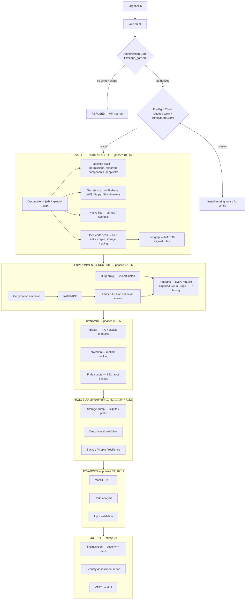

# Genymotion APK Pentesting Pipeline

Automated mobile application security testing pipeline using Genymotion emulator. Covers APK acquisition → static analysis → dynamic instrumentation → traffic capture → findings reporting.

> **Authorized engagements only.** Always obtain written scope before testing any application.

---

## Pipeline Overview



> **On-screen runtime:** once the APK is installed (phase 02) the app is launched and driven
> on the emulator screen while Burp captures the live traffic (phase 06) — this is where
> API endpoints, auth flows and hidden requests are discovered for later phases.
>
> **SAST approaches:** the decompiled source is audited across several tracks — manifest
> hardening (permissions / exported components / deep links), hardcoded secrets (Firebase,
> AWS, Stripe, GitHub tokens), native-library exposure, and deep code scans for RCE sinks
> (`Runtime.exec`, deserialization), weak crypto (DES/MD5/ECB), insecure storage
> (SharedPreferences/SQLite), logging leaks and debug guards — plus a Semgrep pass with
> MASTG-aligned rules.

---

## Pipeline Phases

| Phase | Script | Description |
|-------|--------|-------------|
| 00 | `acquire.sh` | Download APK from Play Store / APKPure / APKMirror |
| 01 | `static.sh` | jadx decompile, manifest audit, secrets extraction, native lib analysis |
| 02 | `setup_genymotion.sh` | Create/start Genymotion device, install APK |
| 03 | `dynamic_drozer.sh` | Drozer enumeration + exploitation modules |
| 04 | `dynamic_objection.sh` | Frida-based runtime hooking (SSL pinning, root bypass, keychain) |
| 05 | `frida_hooks.sh` | Custom Frida scripts (method tracing, memory search, SSL bypass) |
| 06 | `traffic_capture.sh` | Burp proxy setup, traffic logging, API endpoint extraction |
| 07 | `storage_dump.sh` | Extract SharedPreferences, SQLite, files, keychain |
| 08 | `findings_report.sh` | Aggregate findings, generate report |

---

## Quick Start

```bash
# 1. Setup
./setup.sh

# 2. Edit config
vi config/target.yaml

# 3. Run full pipeline
./run.sh all

# 4. Run specific phase
./run.sh 01_static
./run.sh 04_dynamic_objection
```

---

## Prerequisites

The pipeline **validates prerequisites before running anything**. `./run.sh check`
is enforced automatically before `all` and before any individual phase — if a
required tool or config value is missing, the run aborts with a list of what to fix.

> Run `./run.sh check` any time to see exactly what is missing before starting.

### Required (enforced — run aborts if missing)

| Tool | Purpose | Install |
|------|---------|---------|
| Genymotion | Android emulator | `~/genymotion-3.10.0-linux_x64.run` |
| adb | Android Debug Bridge | `apt install android-tools-adb` |
| drozer | Android security testing | `pip install drozer` |
| objection | Frida-based runtime pentesting | `pip install objection` |
| Frida / frida-ps / frida-trace | Dynamic instrumentation | `pip install frida-tools` |
| jadx | APK decompilation | `apt install jadx` |
| apktool | APK resource/smali decode | `apt install apktool` |
| aapt | APK metadata | `apt install aapt` |
| jq | JSON processing | `apt install jq` |
| python3 / curl | Runtime + HTTP | system |

Config keys required in `config/target.yaml`: `apk.path`, `apk.package_name`,
`genymotion.device_name`, `proxy.host`, `proxy.port`, `target.authorization_ref`.

### Optional (phases degrade gracefully — warned, not fatal)

| Tool | Purpose |
|------|---------|
| nmap, whatweb, ffuf, gobuster, dirb, nuclei, httpx, subfinder, amass, sqlmap | network / recon phases |
| MobSF | `09_mobsf_dast` (Docker: `docker run -p 8000:8000 opensecurity/mobsf`) |
| Burp Suite | traffic interception (`~/BurpSuitePro/BurpSuite`) |

---

## Directory Structure

```
genymotion-pipeline/
├── run.sh                    # Master runner
├── setup.sh                  # Dependency installer
├── config/
│   └── target.yaml           # APK path, device config, proxy, auth
├── phases/
│   ├── 00_acquire.sh         # APK download
│   ├── 01_static.sh          # Static analysis (jadx, secrets, manifest)
│   ├── 02_setup_genymotion.sh # Emulator setup + APK install
│   ├── 03_dynamic_drozer.sh  # Drozer modules
│   ├── 04_dynamic_objection.sh # Objection/Frida hooks
│   ├── 05_frida_hooks.sh     # Custom Frida scripts
│   ├── 06_traffic_capture.sh # Burp proxy + traffic logging
│   ├── 07_storage_dump.sh    # Local storage extraction
│   └── 08_findings_report.sh # Report generation
├── lib/
│   ├── common.sh             # Shared helpers
│   └── findings.sh           # Findings DB
├── extras/
│   ├── burp-browser/         # Playwright + FoxyProxy → Burp
│   ├── frida-scripts/        # Reusable Frida hooks
│   └── objection-scripts/    # Reusable objection commands
├── reports/                  # Per-run output
└── findings/                 # findings.json
```

---

## Configuration

### `config/target.yaml`

```yaml
apk:
  path: "/path/to/app.apk"           # Local APK path
  package_name: "com.example.app"     # Android package name
  download_url: ""                    # Or provide download URL

genymotion:
  device_name: "pipeline-test"        # Genymotion device name
  android_version: "11.0"            # Android version
  resolution: "1080x1920"            # Screen resolution
  memory: 4096                        # RAM in MB

proxy:
  host: "127.0.0.1"
  port: 8080                          # Burp proxy port

frida:
  ssl_bypass: true
  root_bypass: true
  hook_classes: []                    # Additional classes to hook

auth:
  jwt: ""
  headers: {}
```

---

## Features

- **APK Acquisition** — download from Play Store (via adb), APKPure, APKMirror
- **Static Analysis** — jadx decompilation, AndroidManifest audit, hardcoded secrets, API endpoints, native library analysis
- **Genymotion Management** — device creation, start/stop, APK installation
- **Drozer Testing** — content provider enumeration, service exploitation, activity injection
- **Objection/Frida** — SSL pinning bypass, root detection bypass, keychain dump, method hooking
- **Custom Frida Scripts** — method tracing, memory search, SSL bypass, certificate pinning removal
- **Traffic Capture** — Burp proxy chain, API endpoint extraction, request/response logging
- **Storage Dump** — SharedPreferences, SQLite databases, files, keychain entries
- **Findings Report** — aggregated findings with severity, evidence, and remediation

---

## Usage Examples

### Full Pipeline

```bash
./run.sh all                    # Run all phases
./run.sh --skip-static all      # Skip static analysis
```

### Individual Phases

```bash
./run.sh 00_acquire             # Download APK
./run.sh 01_static              # Static analysis
./run.sh 02_setup_genymotion    # Setup emulator
./run.sh 04_dynamic_objection   # Run objection hooks
./run.sh 06_traffic_capture     # Capture traffic
```

### RAG-Enhanced (if configured)

```bash
./run.sh --rag 01_static        # Query RAG for relevant skills
```

---

## Frida Scripts

### SSL Pinning Bypass

```bash
# Using objection
objection -g com.example.app explore
android sslpinning disable

# Using custom Frida script
frida -U -f com.example.app -l extras/frida-scripts/ssl-bypass.js --no-pause
```

### Root Detection Bypass

```bash
objection -g com.example.app explore
android root disable
```

### Method Hooking

```bash
# Trace all calls to a class
frida-trace -U -i "*.login*" com.example.app

# Custom hook
frida -U -f com.example.app -l extras/frida-scripts/method-tracer.js --no-pause
```

---

## Integration with VAPT Pipeline

This pipeline is designed to work standalone or as part of the larger VAPT pipeline:

```bash
# From VAPT pipeline: hand off APK to Genymotion pipeline
./extras/apk_handoff.sh /path/to/app.apk

# From Genymotion pipeline: hand off findings to VAPT pipeline
# (outputs hosts/keys that can be fed into VAPT phases)
```

---

## Disclaimer

This tool is for **authorized security testing only**. Always obtain written permission before testing any application. The authors are not responsible for misuse or damage caused by this tool.

---

## License

MIT
